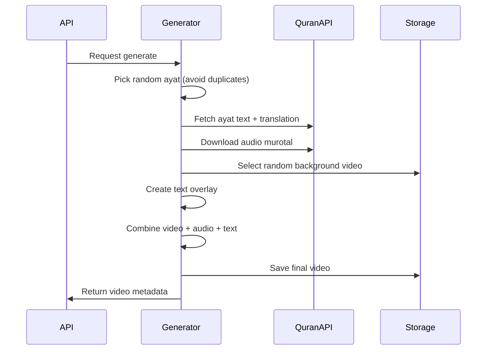

# Design Document

## Overview

Sistem Quran Video Generator adalah aplikasi web yang secara otomatis menghasilkan video quotes Al-Quran untuk konten TikTok. Sistem menggunakan API eksternal untuk mengambil teks dan audio murotal, menggabungkannya dengan background video pemandangan aesthetic, dan menghasilkan video siap posting dalam format 9:16.

Aplikasi di-deploy menggunakan Docker dan dapat diakses melalui IP public VPS.

## Architecture


## Components and Interfaces

### 1. Web Interface (Frontend)

**Technology:** React dengan Vite atau Next.js

**Pages:**
- Dashboard: daftar video, status generate, statistik
- Generate: form untuk trigger generate manual/batch
- Settings: pilihan qari, konfigurasi scheduler
- Videos: gallery video dengan preview dan download

**API Endpoints yang digunakan:**
```
GET  /api/videos          - List semua video
POST /api/generate        - Trigger generate video
GET  /api/generate/status - Cek status generate
GET  /api/settings        - Get settings
PUT  /api/settings        - Update settings
GET  /api/stats           - Get statistik
```

### 2. REST API (Backend)

**Technology:** Python FastAPI

**Endpoints:**

```python
# Videos
GET  /api/videos                 # List videos dengan pagination
GET  /api/videos/{id}            # Get video detail
GET  /api/videos/{id}/download   # Download video file
DELETE /api/videos/{id}          # Delete video

# Generate
POST /api/generate               # Generate video baru
     Body: { "count": 1 }        # Jumlah video
GET  /api/generate/status        # Status generate saat ini
POST /api/generate/cancel        # Cancel generate

# Settings
GET  /api/settings               # Get current settings
PUT  /api/settings               # Update settings
     Body: { "qari": "alafasy", "schedule_enabled": true, "videos_per_day": 5 }

# Stats
GET  /api/stats                  # Statistik (total video, storage used, dll)
```

### 3. Video Generator Service

**Technology:** Python dengan FFmpeg dan MoviePy

**Responsibilities:**
- Fetch ayat random dari Al-Quran Cloud API
- Download audio murotal
- Select random background video
- Overlay teks Arab dan terjemahan
- Render video final

**Process Flow:**


### 4. Task Scheduler

**Technology:** APScheduler (Python)

**Features:**
- Cron-based scheduling untuk auto-generate
- Configurable via API/web interface
- Persistent job store (SQLite)

### 5. TikTok Auto-Posting Service

**Technology:** Playwright (Python) - Headless Browser Automation

**Responsibilities:**
- Login ke TikTok dan simpan session cookies
- Upload video ke TikTok secara otomatis
- Generate caption dengan ayat + hashtag
- Track status posting

**Process Flow:**


**API Endpoints:**
```python
# TikTok Integration
POST /api/tiktok/login           # Initiate login flow (returns QR/manual login)
GET  /api/tiktok/status          # Check login status
POST /api/tiktok/post/{video_id} # Manual post video to TikTok
GET  /api/tiktok/history         # Get posting history
PUT  /api/tiktok/settings        # Update auto-post settings
```

**Session Management:**
- Session cookies disimpan di volume persistent
- Auto-refresh session jika expired
- Alert jika perlu re-login

**Caption Generation:**

Sistem mendukung 2 mode caption:

**Mode 1: Template Statis**
```
{surah_name} - Ayat {ayat_number}

{translation_text}

#quran #murotal #islamic #muslim #ayatquran #dakwah #islam #fyp
```

**Mode 2: AI-Generated Caption (OpenAI)**
- Menggunakan GPT-3.5/GPT-4o-mini untuk generate caption yang engaging
- Input: ayat Arab, terjemahan, nama surah
- Output: caption dengan konteks/hikmah, emoji, dan hashtag
- Variasi otomatis agar tidak monoton

**Contoh AI Caption:**
```
✨ Renungan Malam ✨

Al-Baqarah ayat 286 mengajarkan kita bahwa Allah Maha Adil dan tidak akan membebani hamba-Nya di luar kemampuannya.

"Allah tidak membebani seseorang melainkan sesuai dengan kesanggupannya"

Semoga menjadi pengingat bagi kita semua 🤲

#quran #murotal #islamic #muslim #fyp #dakwah #motivasiislami
```

**API Endpoint untuk Caption:**
```python
POST /api/caption/generate
     Body: { "video_id": "xxx", "mode": "ai" }  # mode: "template" atau "ai"
```

### 6. External API Integration

**Al-Quran Cloud API:**
```
Base URL: https://api.alquran.cloud/v1

# Get ayat dengan teks Arab
GET /ayah/{surah}:{ayat}

# Get ayat dengan audio (qari specific)
GET /ayah/{surah}:{ayat}/ar.alafasy

# Get terjemahan Indonesia
GET /ayah/{surah}:{ayat}/id.indonesian
```

**Qari Options:**
- `ar.alafasy` - Mishary Rashid Alafasy
- `ar.abdulbasit` - Abdul Basit Abdul Samad
- `ar.abdurrahmaansudais` - Abdurrahman As-Sudais
- `ar.husary` - Mahmoud Khalil Al-Husary
- `ar.minshawi` - Mohamed Siddiq El-Minshawi

## Data Models

### Video Model
```python
class Video:
    id: str                  # UUID
    surah: int               # Nomor surah (1-114)
    ayat: int                # Nomor ayat
    surah_name: str          # Nama surah
    text_arab: str           # Teks Arab
    text_translation: str    # Terjemahan Indonesia
    qari: str                # Qari yang digunakan
    background_file: str     # Nama file background
    output_file: str         # Path file video output
    duration: float          # Durasi video (detik)
    file_size: int           # Ukuran file (bytes)
    created_at: datetime     # Waktu generate
    status: str              # pending, processing, completed, failed
```

### Settings Model
```python
class Settings:
    qari: str = "alafasy"              # Default qari
    schedule_enabled: bool = False      # Auto-generate aktif
    schedule_time: str = "06:00"        # Waktu generate harian
    videos_per_day: int = 5             # Jumlah video per hari
    max_ayat_length: int = 500          # Max karakter ayat (filter ayat panjang)
    
    # TikTok Settings
    tiktok_auto_post: bool = False      # Auto-post ke TikTok
    tiktok_post_delay: int = 60         # Delay antar posting (menit)
    tiktok_hashtags: str = "#quran #murotal #islamic #muslim #fyp"
    
    # AI Caption Settings
    caption_mode: str = "template"      # "template" atau "ai"
    openai_api_key: str = ""            # OpenAI API key (encrypted)
```

### TikTokSession Model
```python
class TikTokSession:
    id: str                  # Session ID
    cookies: str             # Encrypted cookies JSON
    username: str            # TikTok username
    is_valid: bool           # Session masih valid
    last_used: datetime      # Terakhir digunakan
    created_at: datetime
```

### PostHistory Model
```python
class PostHistory:
    id: str                  # History ID
    video_id: str            # Reference ke Video
    tiktok_url: str          # URL post di TikTok (jika berhasil)
    caption: str             # Caption yang digunakan
    status: str              # success, failed, pending
    error_message: str       # Error jika gagal
    posted_at: datetime
```

### GenerateJob Model
```python
class GenerateJob:
    id: str                  # Job ID
    count: int               # Jumlah video diminta
    completed: int           # Jumlah selesai
    failed: int              # Jumlah gagal
    status: str              # running, completed, cancelled
    started_at: datetime
    finished_at: datetime
```

## Error Handling

### API Errors
- **QuranAPI unavailable:** Retry 3x dengan exponential backoff, lalu fail gracefully
- **Audio download failed:** Skip ayat, pilih ayat lain
- **FFmpeg error:** Log error detail, mark video as failed

### User-facing Errors
- Tampilkan pesan error yang jelas di UI
- Provide retry option untuk failed videos
- Log semua error untuk debugging

### Storage Errors
- Check disk space sebelum generate
- Alert jika storage < 1GB remaining
- Auto-cleanup old videos (optional, configurable)

## Testing Strategy

### Unit Tests
- Test video generator functions (text overlay, audio merge)
- Test API endpoint responses
- Test scheduler job creation/execution

### Integration Tests
- Test full generate flow (API → Generator → Storage)
- Test external API integration dengan mock
- Test Docker container startup

### Manual Testing
- Verify video output quality
- Test web interface responsiveness
- Test pada berbagai browser

## Deployment

### Docker Setup
```yaml
# docker-compose.yml structure
services:
  app:
    build: .
    ports:
      - "8080:8080"
    volumes:
      - ./data/videos:/app/videos
      - ./data/backgrounds:/app/backgrounds
      - ./data/db:/app/db
      - ./data/sessions:/app/sessions
    environment:
      - PEXELS_API_KEY=${PEXELS_API_KEY}
    # Required for Playwright headless browser
    shm_size: '2gb'
```

### Directory Structure
```
/app
├── /api              # FastAPI backend
├── /frontend         # React frontend (built)
├── /generator        # Video generator module
├── /tiktok           # TikTok uploader module (Playwright)
├── /videos           # Generated videos (volume)
├── /backgrounds      # Background video collection (volume)
├── /sessions         # Browser sessions/cookies (volume)
├── /db               # SQLite database (volume)
└── docker-compose.yml
```

### Environment Variables
```
PEXELS_API_KEY=xxx        # Untuk download background videos
OPENAI_API_KEY=xxx        # Untuk AI caption generation (optional)
PORT=8080                 # Port aplikasi
DATA_DIR=/app/data        # Directory untuk persistent data
PLAYWRIGHT_BROWSERS_PATH=/app/browsers  # Playwright browser path
```


## Correctness Properties

*A property is a characteristic or behavior that should hold true across all valid executions of a system-essentially, a formal statement about what the system should do. Properties serve as the bridge between human-readable specifications and machine-verifiable correctness guarantees.*

### Property 1: Valid Ayat Selection
*For any* generated video, the selected ayat SHALL be within valid range (surah 1-114, ayat within surah bounds) and exist in Al-Quran.
**Validates: Requirements 1.1**

### Property 2: Complete Data Retrieval
*For any* valid ayat selection, the system SHALL successfully retrieve text Arab, terjemahan Indonesia, and audio murotal URL from the API.
**Validates: Requirements 1.2**

### Property 3: Video Output Format Compliance
*For any* generated video file, the output SHALL be in MP4 format with aspect ratio 9:16 (1080x1920 or equivalent).
**Validates: Requirements 1.4**

### Property 4: Batch Uniqueness
*For any* batch generation request with count N, all N generated videos SHALL have unique ayat (no duplicates within the batch).
**Validates: Requirements 1.5**

### Property 5: Qari Audio Consistency
*For any* video generation with a specified qari setting, the downloaded audio SHALL match the selected qari identifier.
**Validates: Requirements 3.2**

### Property 6: Background Selection Validity
*For any* generated video, the selected background video SHALL exist in the backgrounds collection.
**Validates: Requirements 3.3**

### Property 7: Translation Inclusion
*For any* generated video metadata, the translation text SHALL be non-empty and in Indonesian language.
**Validates: Requirements 3.5**

### Property 8: Progress Accuracy
*For any* batch generation job, the reported progress (completed/total) SHALL accurately reflect the actual number of completed videos.
**Validates: Requirements 2.5**

### Property 9: Data Persistence
*For any* video saved to storage, the video file and metadata SHALL persist across system restarts.
**Validates: Requirements 4.3, 4.4**

### Property 10: Error Logging
*For any* error that occurs during video generation, the system SHALL create a corresponding log entry with error details.
**Validates: Requirements 4.5**

### Property 11: Scheduler Execution
*For any* enabled schedule configuration, the system SHALL trigger video generation within acceptable time tolerance of the scheduled time.
**Validates: Requirements 5.1**

### Property 12: Generation History Tracking
*For any* completed video generation (manual or scheduled), the system SHALL record the generation event in history.
**Validates: Requirements 5.3**

### Property 13: Storage Alert Threshold
*For any* storage state where available space is below threshold (e.g., 1GB), the system SHALL report low storage status.
**Validates: Requirements 5.4**

### Property 14: TikTok Session Persistence
*For any* valid TikTok login session, the session cookies SHALL persist across system restarts and remain usable.
**Validates: Requirements 6.1**

### Property 15: TikTok Upload Completion
*For any* video upload to TikTok, the system SHALL either successfully post the video OR record a failure with error details.
**Validates: Requirements 6.2, 6.5**

### Property 16: Caption Generation
*For any* TikTok post, the caption SHALL contain the surah name, ayat number, translation text, and configured hashtags.
**Validates: Requirements 6.3**

### Property 17: Post Status Tracking
*For any* TikTok posting attempt, the system SHALL record the posting status (success/failed) in the database.
**Validates: Requirements 6.4**

### Property 18: AI Caption Content Validity
*For any* AI-generated caption, the output SHALL contain the surah name, ayat number, and relevant Islamic hashtags.
**Validates: Requirements 6.3**
